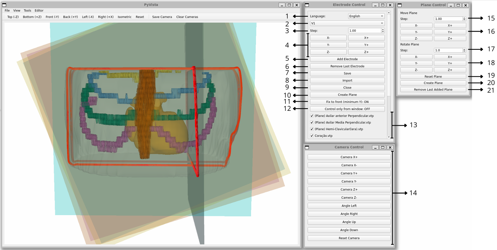

# Eletrodo3D Software

## Install Eletrodo3D and its dependencies:

```
git clone https://github.com/faesy/Eletrodo3D.git
cd Eletrodos3D
```
```
python3 -m venv Eletrodos3D
source Eletrodos3D/bin/activate
pip install -r requirements.txt
```

## Run Eletrodos3D:

```
source Eletrodos3D/bin/activate
```

```
python3 Eletrodos_3d.py
```

* Choose the directory with the .vtp files

* Use the software to mark and save electrodes. Tools:
    01. Select the language (English or Portuguese)
    02. Select the electrode to be marked
    03. Choose the step size for moving an electrode
    04. Move the electrode along a given axis
    05. Mark the selected position for the chosen electrode
    06. Remove the last marked electrode
    07. Save the marked electrodes to a .txt file
    08. Import previously marked electrodes
    09. Close the program
    10. When OFF, allows marking electrodes outside the torso
    11. When ON, disables direct electrode marking in the graphical interface
    12. Determine which geometries are visible
    13. Control the camera

<p align="center">
  
</p>